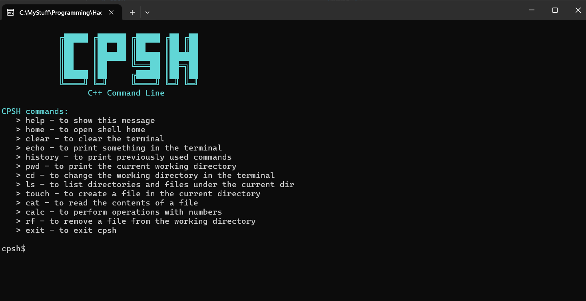
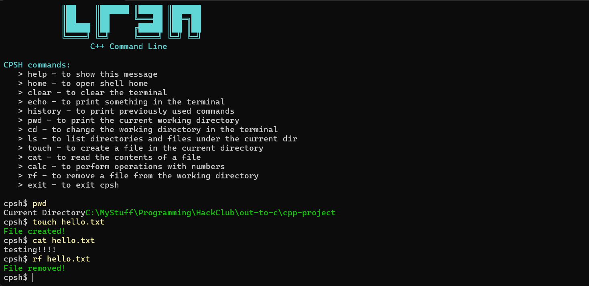

# CPSH
  
`C++ Command Line`  
A cool shell application built in C++ by me for windows. This is my first ever project in c++, and ive never been familiar with C or C# too. The ascii art above is drawn by me!!  

## Commands to try out:
- **help**: to show the list of commands
- **home**: to display the ascii art and the commands
- **clear**: to clear the shell
- **echo**: To print something in the shell
- **history**: to display the history of commmands
- **pwd**: To see the current working directory
- **cd**: To change the working directory
- **ls**: To list the elements of the working directory
- **touch**: to create a file in the working directory
- **cat**: To read the contents of a file
- **rf**: To remove a file from the directory
- **exit**: To exit the application

## How to install:
- Go to the releases page here, and download the latest exe file.
- Run the exe file normally, and CPSH opens in your teminal.
- Read the commands and try them out!

## Runnning locally:
- Clone this repository:   `git clone https://github.com/Sankarshan-T/cpsh`
- Compile all files using:   `g++ main.cpp parser.cpp commands.cpp -o my-cpsh.exe`
- Then run it with `my-cpsh.exe`(for command prompt) or `./my-cpsh.exe` (for powershell)

## Made completely using C++

## Gallery:

